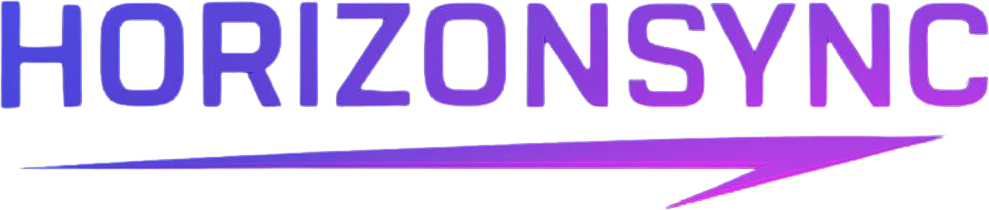

<p align="center">
  
</p>

<p align="center">
  
</p>

---
<p align="center">
  Unified communication, publishing, and execution for modern teams.
</p>

HorizonSync is a unified collaboration platform that combines:

- real-time team communication inspired by Discord
- a public social feed inspired by Twitter/X
- a private knowledge and execution workspace inspired by Notion

The product is designed as a single, cohesive operating surface for modern teams that want communication, planning, publishing, and AI assistance in one place.

## Product Overview

HorizonSync is built around three core pillars:

- `Hubs`
  Real-time team collaboration with channels, direct messages, reactions, forwarding, and side-panel threads.

- `Global`
  Organization-wide publishing with rich posts, comments, likes, bookmarks, quote-posting, polls, and author post management.

- `My Space`
  A personal execution layer with nested documents, reminders, slash-command editing, drag-and-drop blocks, and structured workspace views such as list, kanban, and calendar.

## Highlights

- production-grade Next.js App Router architecture
- strongly typed end-to-end TypeScript codebase
- Prisma + PostgreSQL data model
- NextAuth-based authentication
- responsive theme-aware UI
- real-time messaging with Pusher
- branded login security notifications by email
- AI drafting assistant integration
- modular shared UI primitives for drawers, toasts, skeletons, and transitions

## Feature Parity Status

### Hubs

- channel chat and direct messages
- message editing and soft deletion
- forwarding references
- emoji reactions
- side-panel threads
- typing indicators and presence
- file and image attachments

### Global

- create post with media
- quote-posting
- optimistic likes, bookmarks, comments
- author archive and delete actions
- poll creation and voting
- bookmarks tab
- infinite scroll feed loading

### My Space

- nested document hierarchy
- reminders and follow-ups
- slash commands in the editor
- drag-and-drop block reordering
- sub-page creation
- list, kanban, and calendar workspace views

## Architecture

### Frontend

- `Next.js 14`
- `React 18`
- `Tailwind CSS`
- `framer-motion`
- `next-themes`

### Backend

- `Next.js Route Handlers`
- `Server Actions`
- `Prisma ORM`
- `PostgreSQL`
- `NextAuth`
- `Pusher`
- `UploadThing`
- `Nodemailer`

### Repository Structure

```text
src/
  app/
    (auth)/
    (main)/
    api/
  modules/
    ai/
    auth/
    global/
    hubs/
    myspace/
    profile/
  shared/
    components/
    hooks/
    lib/
prisma/
public/
```

## Tech Decisions

- `App Router` keeps route-level layouts and loading states modular.
- `Server Actions` are used where mutation ergonomics and type sharing matter.
- `Route Handlers` are used for client-side fetch flows, realtime-related endpoints, and external service boundaries.
- `Prisma` provides the relational base for social, communication, and workspace features.
- `Pusher` handles realtime message fanout, presence, and incremental UI updates.

## Environment Variables

Copy `.env.example` to `.env` for local development, and mirror the same variables in Vercel or Render.

### Core

```bash
DATABASE_URL=
NEXTAUTH_SECRET=
NEXTAUTH_URL=
NEXT_PUBLIC_APP_URL=
```

### OAuth Providers

```bash
GOOGLE_CLIENT_ID=
GOOGLE_CLIENT_SECRET=
TWITTER_CLIENT_ID=
TWITTER_CLIENT_SECRET=
MICROSOFT_CLIENT_ID=
MICROSOFT_CLIENT_SECRET=
MICROSOFT_TENANT_ID=
```

### Realtime

```bash
PUSHER_APP_ID=
PUSHER_KEY=
PUSHER_SECRET=
PUSHER_CLUSTER=
NEXT_PUBLIC_PUSHER_KEY=
NEXT_PUBLIC_PUSHER_CLUSTER=
```

### Uploads

```bash
UPLOADTHING_SECRET=
UPLOADTHING_APP_ID=
```

### AI

```bash
OPENAI_API_KEY=
OPENAI_MODEL=gpt-4o-mini
```

### Email Notifications

```bash
EMAIL_SERVER_HOST=
EMAIL_SERVER_PORT=
EMAIL_SERVER_USER=
EMAIL_SERVER_PASSWORD=
EMAIL_FROM=
```

## Local Development

### 1. Install dependencies

```bash
npm install
```

### 2. Generate Prisma client

```bash
npx prisma generate
```

### 3. Run database migrations

```bash
npx prisma migrate dev
```

### 4. Start the app

```bash
npm run dev
```

## Build and Verification

```bash
npx tsc --noEmit
npm run build
```

## Security Posture

HorizonSync includes:

- server-side input sanitization helpers
- same-origin protection for mutation routes
- session-protected route groups
- soft-delete patterns for sensitive content
- branded login notification emails
- screenshot monitoring alerts on the client

## UI / UX Notes

- dual theme system with explicit dark and light visual identities
- mobile-first responsive layouts
- drawer-based navigation on smaller screens
- loading skeletons and smooth route transitions
- polished, high-contrast collaboration surfaces

## Deployment Notes

HorizonSync is designed to run well on a standard Next.js deployment stack such as:

- Vercel for app hosting
- Neon, Supabase, or Railway PostgreSQL for data
- Pusher for realtime delivery
- UploadThing for file handling
- Resend or SMTP-compatible mail infrastructure

## Deploying to Vercel

1. Import the repository into Vercel.
2. Set the framework preset to `Next.js`.
3. Add every environment variable from `.env.example`.
4. Point `NEXTAUTH_URL` and `NEXT_PUBLIC_APP_URL` to your Vercel production URL.
5. Use a managed PostgreSQL database and run `npx prisma migrate deploy` against production before launch if it has not already been executed.

The repository includes `vercel.json` and a `postinstall` Prisma generate step so the build is production-safe by default.

## Deploying to Render

1. Create a new Blueprint or Web Service from this repository.
2. Render will detect `render.yaml` and configure the Node service.
3. Set all secret environment variables in the Render dashboard.
4. Point `NEXTAUTH_URL` and `NEXT_PUBLIC_APP_URL` to your Render domain or custom domain.
5. Confirm that your production database is reachable from Render before the first deploy.

The Render service is configured to:

- install dependencies
- run the production build
- execute `prisma migrate deploy` on startup
- serve the app with `next start`

## Recommended Production Checklist

- configure a managed PostgreSQL database
- run Prisma migrations in the target environment
- set all auth provider secrets
- set all Pusher keys for realtime
- configure SMTP credentials for security emails
- set the OpenAI key for AI assistant features
- verify UploadThing credentials
- confirm `NEXTAUTH_URL` and `NEXT_PUBLIC_APP_URL`
- verify the logo and banner are present in `public/branding`
- update your custom domain DNS before opening public access

## Roadmap Direction

Potential future expansion areas:

- moderation and admin controls for Hubs
- richer analytics on Global engagement
- collaborative editing in My Space
- activity audit logs
- organization-level settings and billing

## Author

<p align="center">
  
</p>

<p align="center">
  <strong>Crafted by Rudranarayan Jena</strong>
</p>

<p align="center">
  Product builder, Full-stack Developer, AI Enthuiast and the creator behind HorizonSync.
</p>

<p align="center">
  <a href="https://github.com/-liambrooks-lab"><strong>GitHub: @-liambrooks-lab</strong></a>
</p>
